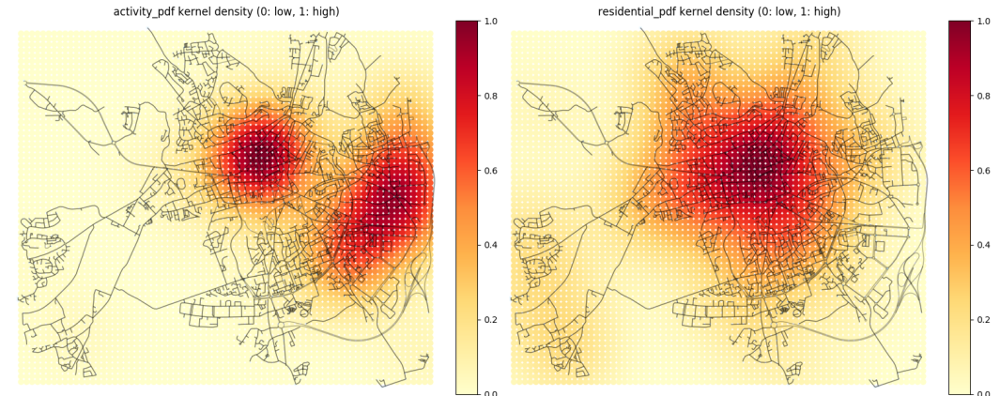
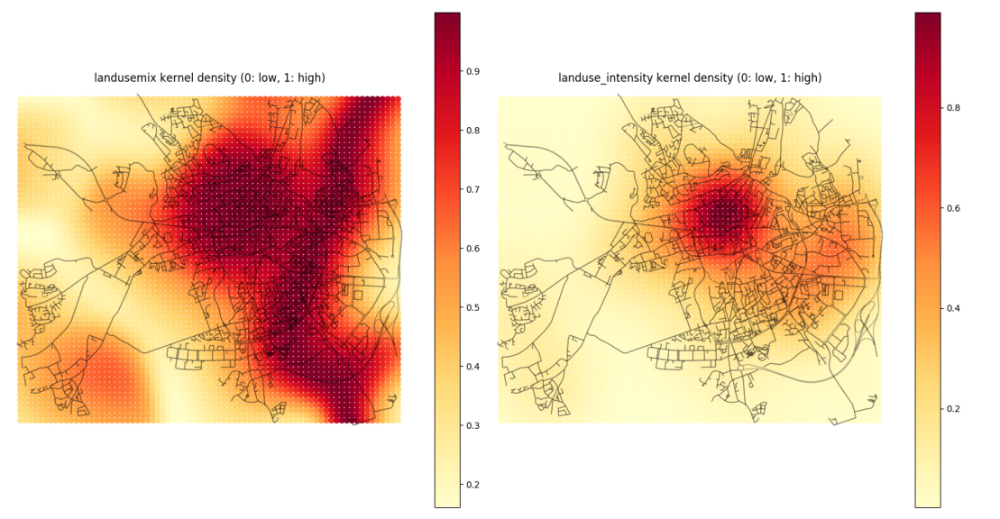
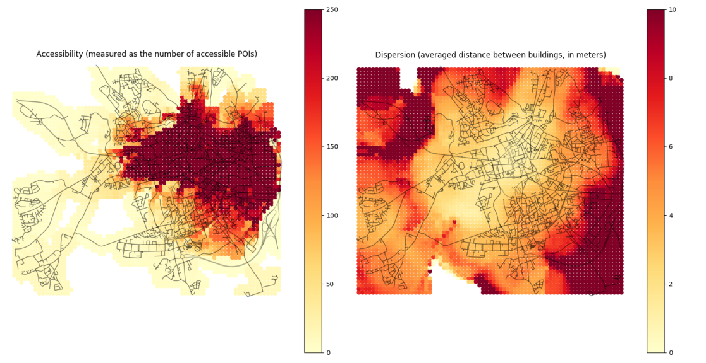
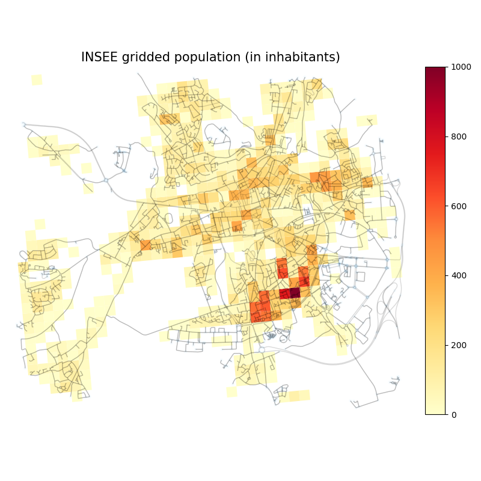

# About Urbansprawl

*The **urbansprawl** project takes its origin from a PhD thesis that was
defended in november 2018 by Luciano Gervasoni at Inria. Thanks to Luciano for
the seminal developments (https://github.com/lgervasoni/urbansprawl)!  Oslandia
takes over from Inria fellows for industrial developments, and **now hosts the
upstream version of the project**.*

The project provides an open source framework for assessing urban sprawl using
open data. It uses OpenStreetMap (OSM) data to calculate its sprawling indices,
divided in *Accessibility*, *Land use mix*, and *Dispersion*.

Locations of residential and activity (e.g. shop, commerce, office, among
others) units are used to measure mixed use development and built-up
dispersion, whereas the street network is used to measure the accessibility
between different land uses. The output consists of spatial indices, which can
be easily integrated with GIS platforms.

Additionally, a method to perform dissagregated population estimates at
building level is provided. Our goal is to estimate the number of people living
at the fine level of individual households by using open urban data
(OpenStreetMap) and coarse-scaled population data (census tract).

# Installation

The urbansprawl framework works with Python 2+3.

## Using pip

- Install the ```spatialindex``` library. Using apt-get (Linux):
```sh
sudo apt-get install libspatialindex-dev
```
- Install the dependencies using *pip*
```sh
pip install osmnx scikit-learn psutil tensorflow keras jupyter
```

## Using Miniconda

- Install [Miniconda](https://conda.io/miniconda.html)
- [Optional] Create a [conda virtual environment](http://conda.pydata.org/docs/using/envs.html) 
```
conda create --name urbansprawl-env
source activate urbansprawl-env
```

- Install the dependencies using the conda package manager and the conda-forge channel
```sh
conda install -c conda-forge libspatialindex osmnx scikit-learn psutil tensorflow keras jupyter
```

## Using Anaconda

- Install [Anaconda](https://www.anaconda.com/download)
- [Optional] Create a [conda virtual environment](http://conda.pydata.org/docs/using/envs.html) 
```
conda create --name urbansprawl-env
source activate urbansprawl-env
```

- Install the dependencies using the conda package manager and the conda-forge channel
```sh
conda update -c conda-forge --all
conda install -c conda-forge osmnx scikit-learn psutil tensorflow keras jupyter
```

## Usage

The framework is presented through
different
[examples](https://github.com/lgervasoni/urbansprawl/tree/master/examples) in
the form of notebooks. As well, the computational running times involved in
each procedure are shown for each example. To this end, a
_r5.large_ [AWS EC2](https://aws.amazon.com/ec2/) instance was employed (2 vCPU
and 16GiB memory) to run the notebooks.

Please note that the different procedures can be both memory and time
consuming, according to the size of the chosen region of interest. In order to
run the different notebooks, type in a terminal:

```sh
jupyter notebook
```

## Example

OpenStreetMap data is retrieved using the Overpass API. An input region of
interest can be extracted by:

* Place + result number: The name of the city/region, and the resulting number to retrieve (as seen in OpenStreetMap result order)
* Polygon: A polygon with the coordinates delimitating the desired region of interest
* Bounding box: Using northing, southing, easting, and westing coordinates
* Point + distance (meters): Use the (latitude, longitude) central point plus an input distance around it
* Address + distance (meters): Set the address as central point and an input distance around it

Additionally, the state of the database can be retrieved for a specific data.
This allows for comparisons across time and keeping track of a city's
evolution.

For a sake of demonstration, results are depicted for the city of **Evreux,
France**, a medium-sized city in Normandy:

- Activity and residential probability density function estimated using Kernel
  Density Estimation (KDE), with a 100m-sized grid



- Land use as a degree of co-occurence of activity and residential land uses
  within "walkable" distances (mix indice and land use intensity)



- Accessibility indice, that denotes the degree of accessibility to differing
  land uses (from residential to activity uses), as the cumulative number of
  activity opportunities found within a certain travel distance (here, 250m)
- Dispersion indice, that denotes the degree of scatteredness of the built-up
  area



- Population densities (INSEE census data):



# References

For more details about the project, please refer to following Inria
publications:

* Gervasoni Luciano, Bosch Martí, Fenet Serge, and Sturm Peter. 2016. "[A framework for evaluating urban land use mix from crowd-sourcing data](https://hal.inria.fr/hal-01396792)." 2nd International Workshop on Big Data for Sustainable Development (IEEE Big Data 2016).
* Gervasoni Luciano, Bosch Martí, Fenet Serge, and Sturm Peter. 2017. "[LUM_OSM: une plateforme pour l'évaluation de la mixité urbaine à partir de données participatives](https://hal.inria.fr/hal-01548341)." GAST Workshop, Conférence Extraction et Gestion de Connaissances (EGC 2017).
* Gervasoni Luciano, Bosch Martí, Fenet Serge, and Sturm Peter. 2017. "[Calculating spatial urban sprawl indices using open data](https://hal.inria.fr/hal-01535469)." 15th International Conference on Computers in Urban Planning and Urban Management (CUPUM 2017).
* Gervasoni Luciano, Fenet Serge, and Sturm Peter. 2018. "[Une méthode pour l’estimation désagrégée de données de population à l’aide de données ouvertes](https://hal.inria.fr/hal-01667975)." Conférence Internationale sur l'Extraction et la Gestion des Connaissances (EGC 2018).
* Gervasoni Luciano, Fenet Serge, Perrier Régis and Sturm Peter. 2018. "[Convolutional neural networks for disaggregated population mapping using open data](https://hal.inria.fr/hal-01852585)." IEEE International Conference on Data Science and Advanced Analytics (DSAA 2018).
